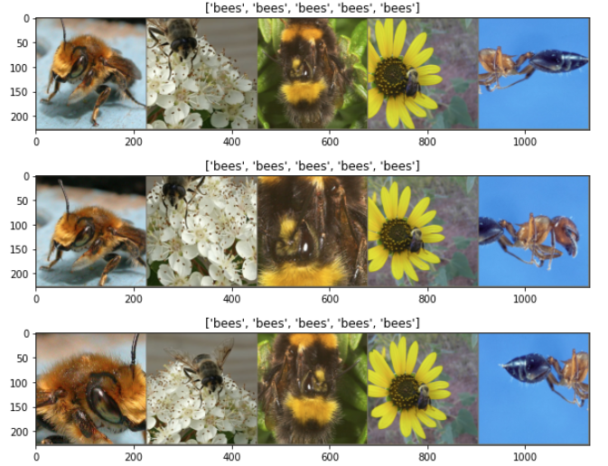
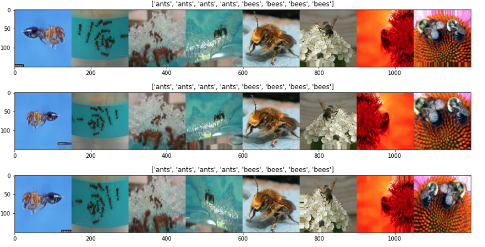
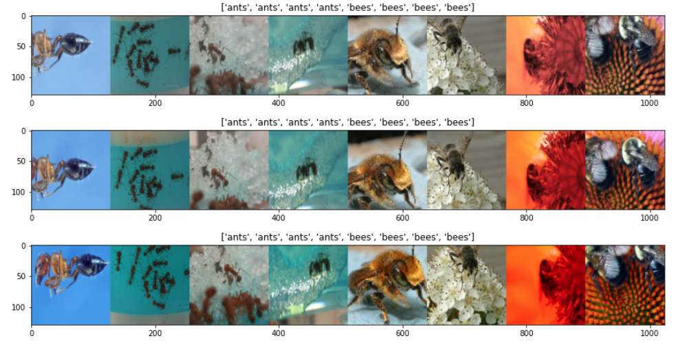

# Tensorflow vs Pyorch

## 1. Simple RNN Model
### 1.1 Tensorflow
```
# sincurve fitting

hidden_dim = 10
model = tf.keras.models.Sequential([ 
tf.keras.layers.RNN(tf.keras.layers.SimpleRNNCell(hidden_dim),return_sequences=True,return_state=False), tf.keras.layers.Dense(1)])

N = 1000

x = np.linspace(0, 2 * np.pi, N)
y = np.sin(x) + np.random.uniform(-0.05, 0.05, size=x.shape)

data_x = np.array(y[:-1])
data_y = np.array(y[1:])


num_iter = 500
T= 5
optimizer = tf.keras.optimizers.Adam(lr=0.01)
loss_fn = tf.keras.losses.MeanSquaredError()
train_loss = []
for i in range(num_iter):
    random_pos = np.random.randint(0,len(data_x)-T)
    input_x = data_x[random_pos:random_pos+T].reshape(1,T,1)
    target = data_y[random_pos:random_pos+T].reshape(1,T,1)

    with tf.GradientTape() as tape:
        pred = model(input_x)
        loss = loss_fn(pred,target)

    gradients = tape.gradient(loss, model.trainable_variables)    
    optimizer.apply_gradients(zip(gradients, model.trainable_variables))
    train_loss.append(loss.numpy())

    if i% 20 ==0:
        print(f'{i}: loss: {loss}')

plt.plot(train_loss)
plt.show()

pred = model(data_x.reshape(1,-1,1))  # 

plt.plot(data_y,label='target',linewidth=5)
plt.plot(pred.numpy().reshape(-1),label='pred')

plt.legend()
plt.show()
```
### 1.2 Pytorch
```
# sincurve fitting

class MyRNN(nn.Module):
    def __init__(self,hidden_dim):
        super().__init__()
        self.rnn = nn.LSTM(input_size=1, hidden_size=hidden_dim, num_layers=1,batch_first=True )
        self.fc = nn.Linear(hidden_dim,1)
    def forward(self,x):
        x,h = self.rnn(x)
        out = self.fc(x)
        return out
hidden_dim = 10
model = MyRNN(hidden_dim)

N = 1000

x = np.linspace(0, 2 * np.pi, N)
y = np.sin(x) + np.random.uniform(-0.05, 0.05, size=x.shape)

data_x = torch.Tensor(np.array(y[:-1]))
data_y = torch.Tensor(np.array(y[1:]))


num_iter = 500
T= 5
optimizer = torch.optim.Adam(model.parameters(), lr=0.01)
loss_fn = nn.MSELoss()
train_loss = []
for i in range(num_iter):
    optimizer.zero_grad()

    random_pos = np.random.randint(0,len(data_x)-T)
    input_x = data_x[random_pos:random_pos+T].reshape(1,T,1)
    target = data_y[random_pos:random_pos+T].reshape(1,T,1)

    pred = model(input_x)
    loss = loss_fn(pred,target)
    loss.backward()
    optimizer.step()
    train_loss.append(loss.detach().numpy())

    if i% 20 ==0:
        print(f'{i}: loss: {loss}')

plt.plot(train_loss)
plt.show()

pred = model(data_x.reshape(1,-1,1))  # 

plt.plot(data_y,label='target',linewidth=5)
plt.plot(pred.detach().numpy().reshape(-1),label='pred')

plt.legend()
plt.show()

```

## 2. Data Loading
### 2.1 Tensorflow `tf.data.Dataset`
```
X = np.random.randn(4,2)
Y = np.arange(4)

def map_fn(X,Y):
    return (X + tf.random.normal(X.shape,dtype=X.dtype)*0.01,Y)

dataset = tf.data.Dataset.from_tensor_slices((X,Y))

dataset = dataset.map(map_fn).repeat(2)
dataset = dataset.batch(2)

for d in dataset:
    print(d)

print('=='*10)
print(X)
```

### 2.2 Tensorflow: `tf.keras.utils.Sequence`
- `tf.data.Dataset`과 달리 take(3)가 먹지 않는다. 필요하면, def take(self,n)으로 만들어 주면 된다.
- iteration(eg. for)은 됨.
```
from skimage.io import imread
from skimage.transform import resize
import numpy as np
import math

# Here, `x_set` is list of path to the images
# and `y_set` are the associated classes.

class CIFAR10Sequence(Sequence):

    def __init__(self, x_set, y_set, batch_size):
        self.x, self.y = x_set, y_set
        self.batch_size = batch_size

    def __len__(self):  # len()에 의해 호출됨.
        return math.ceil(len(self.x) / self.batch_size)

    def __getitem__(self, idx):
        batch_x = self.x[idx * self.batch_size:(idx + 1) *
        self.batch_size]
        batch_y = self.y[idx * self.batch_size:(idx + 1) *
        self.batch_size]

        return np.array([resize(imread(file_name), (200, 200)) for file_name in batch_x]), np.array(batch_y)

class MyDataset(tf.keras.utils.Sequence):

    def __init__(self, N,T,batch_size=5):
        self.batch_size=batch_size
        self.T = T
        x = np.linspace(0, 2 * np.pi, N)
        self.raw_data = np.sin(x) + np.random.uniform(-0.05, 0.05, size=x.shape)

    def __len__(self):
        return math.ceil(len(self.raw_data) / self.batch_size)

    def __getitem__(self, idx):
        random_pos = np.random.randint(0,len(self.raw_data)-self.T-1,size=self.batch_size)
        batch_x =[ self.raw_data[p:p+self.T] for p in random_pos ]
        target = [ self.raw_data[p+1:p+1+self.T] for p in random_pos ]

        return np.expand_dims(np.stack(batch_x),-1), np.expand_dims(np.stack(target),-1)

```

### 2.3 Pytorch: `torch.utils.data.Dataset, DataLoader`
- `DataLoader(..., collate_fn= xxx)` collate_fn이 tensorflow의 mapping function 역할을 한다.
- collate_fn에 randomness가 있으면, epoch마다 달라진다.
```
class MyDataset(Dataset): 
    """ Diabetes dataset.""" 
    # Initialize your data, download, etc. 
    def __init__(self,type=0): 
        self.len = 2  # 전체 data 갯수
        if type==0:
            
            self.x_data = []
            for _ in range(self.len):
                random_length = np.random.randint(3,7)  # data의 길이가 random하다고 가정하는 역할.
                self.x_data.append(torch.from_numpy(np.random.randn(random_length))) 
            self.y_data = torch.from_numpy(np.random.rand(self.len,1)) 
        else:
            self.x_data = []
            for _ in range(self.len):
                random_length = np.random.randint(3,7)
                self.x_data.append(2*torch.from_numpy(np.ones(random_length)))  #[2,2,2,...]
            self.y_data = torch.from_numpy(np.zeros([self.len,1]))         
    
    def __getitem__(self, index): 
        if index < self.len:
            return self.x_data[index], self.y_data[index]
        else:
            return torch.ones(4), torch.ones(1)
    
    def __len__(self):
        return self.len+1  # self.len 외에 1


def Mycollate_fn(batch):
    # 후처리 작업: batch data 중에서 max길이를 보고, 그에 맞게 padding을 해주는 작업 같은 것은 collate_fn에서 해줄 수 밖에 없다.
    
    # test 목적으로 batch로 묶는 작업.  ----> 지금 여기서하는 batch를 묶는 작업은 collate_fn에서 해주지 않아도 자동으로 해준다.
    # 여기서 batch_size로 묶는 작업이 필요하다.
    # batch:  data 하나씩,  batch_size만큼의 list ----> 여기서는 mydataset1,mydataset2에서 random하게 추출되어서 mydataset 1,2가 섞여 있다.
    x, y = zip(*batch)
    
    #return torch.cat([t.unsqueeze(0) for t in x], 0), torch.cat([t.unsqueeze(0) for t in y], 0)
    for t in x:
        t += torch.rand(t.shape) # 길이가 달라, 한번에 처리할 수 없어 loop로 처리 --> 각각의 data에 random noise 더하기.
    return pad_sequence(x,batch_first=True,padding_value=99), torch.stack(y)

mydataset1 = MyDataset(0)
mydataset2 = MyDataset(1)
mydataset = ConcatDataset([mydataset1,mydataset2])  # ConcatDataset은 data혼합(병렬 아님)


####### dataset은 index로 iteration 할 수 있다.
for i in range(len(mydataset)):
    print(i, mydataset[i])


train_loader = DataLoader(dataset=mydataset, batch_size=6, shuffle=True, num_workers=2,drop_last=True,collate_fn=Mycollate_fn)

num_epoch=2
for e in range(num_epoch):
    for i, data in enumerate(train_loader):
        print(data[0].size(), data[1].size(), data, '\n')


```
## 3. Image Dataset Loading
- pytorch는 이미지를 변형 후, 0~1 사이값으로 변환
- tensorflow는 0~1 사이값으로 변환 후, 이미지를 변형해도 되고, 이미지 변형 후, 0~1로 변환해도 된다.
## 3.1 Pytorch `torchvision.datasets.ImageFolder`
```
import torchvision
import torchvision.datasets as datasets
import torchvision.transforms as transforms
import numpy as np
import matplotlib.pyplot as plt
def imshow(inp, title=None):
    """Imshow for Tensor."""
    inp = inp.numpy().transpose((1, 2, 0))
    mean = np.array([0.485, 0.456, 0.406])
    std = np.array([0.229, 0.224, 0.225])
    inp = std * inp + mean
    inp = np.clip(inp, 0, 1)
    plt.figure(figsize=(15,15))
    plt.imshow(inp)
    if title is not None:
        plt.title(title)
    plt.pause(0.001)  # pause a bit so that plots are updated

data_dir = './small'   # 테스트를 위해, data몇개만 모아, 작은 dataset을 만듬.

data_transforms = transforms.Compose([
    transforms.RandomResizedCrop(224),
    transforms.RandomHorizontalFlip(),
    transforms.ToTensor(),
    transforms.Normalize([0.485, 0.456, 0.406], [0.229, 0.224, 0.225])
])

train_dataset =  datasets.ImageFolder(data_dir, data_transforms)
class_names = train_dataset.classes
print(class_names)

dataloader = torch.utils.data.DataLoader(train_dataset, batch_size=5,shuffle=True)

for i in range(3):
    inputs, classes = next(iter(dataloader))

    out = torchvision.utils.make_grid(inputs)  # inputs: 5, 3, 224, 224  ---> out: 3, 228, 1132
    imshow(out, title=[class_names[x] for x in classes])
```
<p align="center">  </p>

## 3.2 Tensorflow `tf.keras.preprocessing.image import ImageDataGenerator`
- train/test data가 분리되어 있다면, `ImageDataGenerator`를 각각 만들면 된다.
- train/test data를 분리해야 한다면, `validation_split=0.2`, `subset=training`/`subset='validation`을 이용하면 된다.
-  ImageDataGenerator에 random crop이 
```
import numpy as np
import tensorflow as tf
from tensorflow.keras.preprocessing.image import ImageDataGenerator
import matplotlib.pyplot as plt

data_dir = './small'
train_datagen = ImageDataGenerator(rescale=1./255, shear_range=0.2, zoom_range=0.2, horizontal_flip=True)

#class_mode='categorical'  ==> label을 onehot으로 만들어서 return한다.
train_generator = train_datagen.flow_from_directory(data_dir, target_size=(150, 150), batch_size=8,class_mode='categorical',shuffle=False)

print('class name: ', train_generator.class_indices)  # list(train_generator.class_indices) ==> ['ants', 'bees']
print('batch_size = ',  train_generator.batch_size, 'image shape: ', train_generator.image_shape)

class_names = list(train_generator.class_indices.keys())
for i in range(3):
    inputs, classes = next(iter(train_generator))
    inputs = np.concatenate(inputs, axis=1)  # (N,150,150,3)  ==> (150,750,3)
    classes = classes.argmax(axis=-1)
    plt.figure(figsize=(15,35))
    plt.imshow(inputs)
    plt.title([class_names[x] for x in classes])
    plt.show()

```
<p align="center">  </p>

## 3.3 Tensorflow `tf.keras.preprocessing.image_dataset_from_directory`
- `tf.image.random_flip_left_right`, `tf.image.random_crop` 등으로 preprocessing함수를 만들어 mapping해야 한다.
- tf.image에 rotation이 없다.
```
def my_preprocessing(image,label):

    image = image/255.   # tf.image.convert_image_dtype는 정수가 들어 왔을 때, 0~1로 변환한다. 넘어온 image에는 resize되면서 0~255사이의 float 값이 들어 있다.

    #image = tf.image.random_flip_left_right(image)  # 확률 50%로 고정되어 있음.
    #image = tf.image.random_brightness(image, max_delta=0.3)
    image = tf.image.random_saturation(image, lower=0.5, upper=1.5)  # 채도 조절
    # random crop
    shape = tf.shape(image)  # batch size 알아내기
    #image = tf.image.resize(image, (180,180))
    image = tf.image.random_crop(image,(shape[0],128,128,3))

    image = tf.clip_by_value(image, 0.0, 1.0)

    return image, label

ds = tf.keras.preprocessing.image_dataset_from_directory('./small',class_names=None, color_mode='rgb', batch_size=8, image_size=(150,150), shuffle=False)
class_names = ds.class_names
ds = ds.map(my_preprocessing)
ds = ds.repeat(5)

it = iter(ds)
for i in range(3):
    x, y = next(it)
    x = np.concatenate(x.numpy(), axis=1)  # (N,150,150,3)  ==> (150,750,3)
    plt.figure(figsize=(15,35))
    plt.imshow(x)
    plt.title([class_names[i] for i in y])
    plt.show()

```
<p align="center">  </p>


## 3.4 File Move
- https://github.com/hccho2/Tensorflow-vs-Pyorch/blob/main/utils.py
- 하나의 디렉토레에 이미지파일이 모여 있다면, subdirectory를 만들어 분리할 필요가 있다.
```
def move_files_to_subdirectory():
    # 하나의 디렉토리에 모여 있는 파일을 각각의 sub directory로 이동
    category =['Abyssinian', 'Bengal', 'Birman', 'Bombay']
    
    base_dir = r'D:\hccho\CommonDataset\Pet-Dataset-Oxford\images'
    
    # 디렉토리 만들기
    for c in category:
        dir_name = os.path.join(base_dir,c)
        if not os.path.exists(dir_name):
            os.makedirs(dir_name)
    
    
    all_files = glob.glob(os.path.join(base_dir,"*.jpg"))
    
    print("파일갯수: ", len(all_files))
    
    # file move
    for f in all_files:
        basename = os.path.basename(f)
        c = '_'.join(basename.split('_')[:-1])   # basset_hound_103.jpg --> ['basset', 'hound', '103.jpg']
        shutil.move(f,os.path.join(base_dir,c))
```

# 4. Transfer Learning
## 4.1 Tensorflow Resnet

## 4.2 Pytorch Resnet


